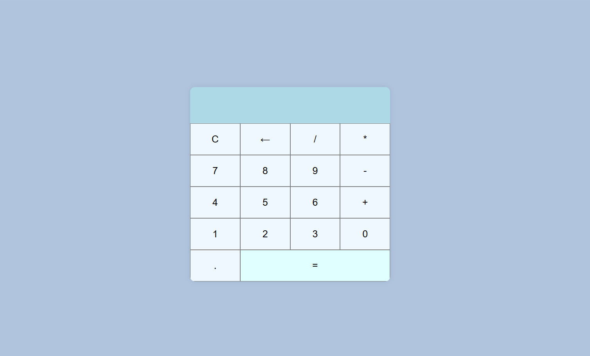

# Simple DOM Project - Calculator

A simple calculator project built using HTML, CSS, and JavaScript. This project demonstrates the use of DOM manipulation to perform basic arithmetic operations (addition, subtraction, multiplication, and division).

---

## Features
- **Interactive UI**: Perform calculations using a clean and simple interface.
- **Basic Operations**: Addition, subtraction, multiplication, and division.
- **Clear Button**: Reset the calculator easily.
- **Responsive Design**: Works well on both desktop and mobile devices.

---

## Project Structure
- `index.html`: Contains the structure of the calculator.
- `styles.css`: Styles the calculator interface.
- `script.js`: Handles the functionality and DOM manipulation.

---

## How to Use
1. Clone or download this repository.
   ```bash
   git clone https://github.com/NoData01/DOMProject-Calculator.git
   ```
2. Open the `index.html` file in a web browser.
3. Start using the calculator by clicking the buttons.

---

## Technologies Used
- **HTML** for structure.
- **CSS** for styling.
- **JavaScript** for interactivity.

---

## Future Enhancements
- Add keyboard input support.
- Improve error handling for invalid inputs.
- Include advanced operations such as square root and exponentiation.

---

